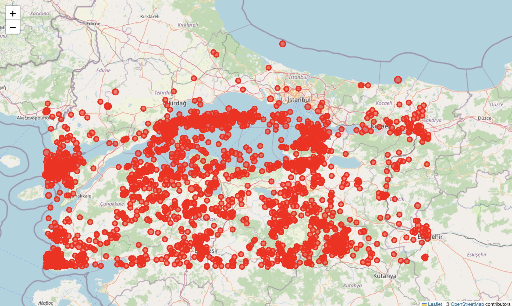
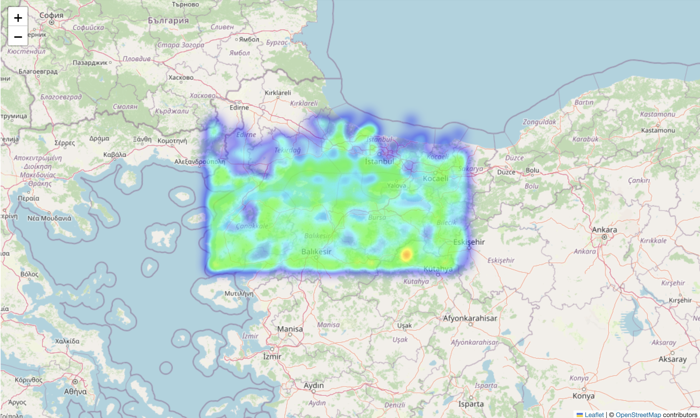
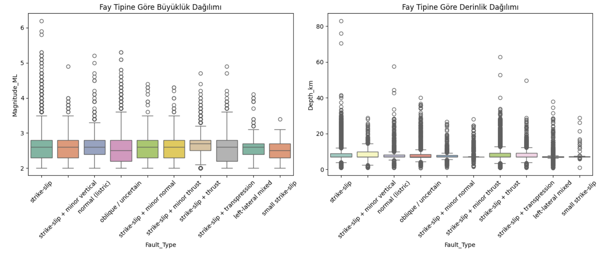

# Marmara Earthquake Project

Bu proje, 2000–2025 yılları arasında Marmara Bölgesi'nde meydana gelen depremleri analiz eden ve görselleştiren bir çalışmadır. Python ve Jupyter Notebook kullanılarak deprem yoğunluğu, zaman-mekan ilişkisi, fay tipi analizi ve tahmin modeli oluşturulmuştur.

## 📁 Proje Dosyaları

| Dosya | Açıklama |
|------|----------|
| `1_data_cleaning_and_filtering.ipynb` | Ham veri temizleme ve filtreleme adımları |
| `2_heatmap_visualization.ipynb` | Isı haritası ile Marmara'daki deprem yoğunluğu analizi |
| `3_time_series_analysis.ipynb` | Zaman serisi ile yıllara göre deprem incelemesi |
| `4_depth_vs_magnitude.ipynb` | Derinlik ve büyüklük arasındaki ilişki analizi |
| `5_fault_type_analysis.ipynb` | Farklı fay türlerinin etkileri |
| `6_prediction_model.ipynb` | Makine öğrenmesiyle basit tahmin modeli |
|`marmara_faults_earthquakes_2000_2025.csv` | Kullanılan veri seti |

## 🖼️ Ekran Görüntüleri

### 🔹 Veri Görselleştirme

### 🔹 Isı Haritası

### 🔹 Tahmin Arayüzü (Streamlit)

Kullanılan Kütüphaneler

- `pandas`
- `numpy`
- `matplotlib`
- `seaborn`
- `scikit-learn`
- `folium`
- `streamlit`

